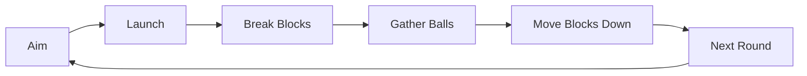

# Brick Breaker

Unity로 제작한 **모바일 세로형 2D 블록 브레이커 게임**입니다.

단순한 1-Ball 블록 깨기 구조에서 시작해 **라운드 진행, 멀티볼, 반사 궤적 예측, +1 보너스 블록, Fever, 자연스러운 공 회수, 난이도 조정**까지 확장했습니다. 기능을 추가하는 데서 끝내지 않고 실제 Play Mode 플레이를 반복하며 입력, 물리, UI, 밸런스 문제를 찾아 수정한 프로젝트입니다.

> **Current stable branch:** `main`  
> **Repository:** Public portfolio project

---

## Project Overview

| 항목 | 내용 |
| --- | --- |
| Engine | Unity 6.3 LTS (`6000.3.23f1`) |
| Language | C# |
| Target | Android / Portrait Mobile |
| Input | Unity New Input System |
| Physics | Rigidbody2D, Collider2D, CircleCast |
| Rendering / UI | LineRenderer, TextMeshPro, Unity UI |
| Runtime pattern | Coroutine, Object Pooling |

### Gameplay Loop



화면 중앙의 **대형 반투명 Round 숫자**는 단순 정보 표시가 아니라 플레이 영역과 라운드 정보를 통합한 핵심 UI 디자인입니다.

---

## Core Features

### Aim & Trajectory Preview

- 클릭 / 탭으로 즉시 발사
- 드래그 중 예상 궤적 표시
- `CircleCast`로 충돌 지점 예측
- 충돌 법선을 이용한 반사 방향 계산
- `LineRenderer`로 다중 반사 궤적 시각화
- 지나치게 수평인 궤적을 방지해 장시간 정체되는 Ball 감소

### Multiball System

- `+1` 특수 블록 획득 시 영구 Ball Count 증가
- 증가한 Ball은 **다음 라운드부터** 적용
- Object Pool 기반 Ball 재사용
- Ball 전용 Layer를 사용해 Ball-Ball 물리 충돌 차단
- 여러 Ball을 동시에 생성하지 않고 순차 발사
- `launchInterval = 0.08s`를 `Time.fixedDeltaTime` 기준 **4 physics ticks**로 처리해 첫 충돌 전 Ball 간격을 일정하게 유지

### Natural Ball Return

- 첫 번째로 바닥에 도착한 Ball의 X 좌표를 다음 발사 위치로 저장
- 첫 Ball은 화면에 남아 다음 라운드의 기준 Ball로 사용
- 나머지 Ball은 약 `0.14s` 동안 첫 Ball 위치로 모인 뒤 Pool로 복귀
- 모든 gather 연출이 끝난 뒤 다음 라운드 진행

### Round Progression

- Score 대신 Round 중심 진행
- 모든 Ball 복귀 후 Round 증가
- 기존 Block은 한 줄 아래로 이동
- 새로운 Row 생성
- Dead Line 초과 시 Game Over
- Pause / Resume 지원
- 장시간 Ball이 남아 있을 경우 자동 `2x / 3x` 속도 증가

### Bonus & Fever

- 한 Row당 Bonus Block 최대 1개
- Bonus Block 획득 시 영구 Ball Count 증가
- 일정 Hit 수 이후 Fever 활성화
- Fever 진입 시 기본 Volley 수만큼 임시 Ball 추가
- 화면 가장자리 Rainbow Border 연출
- 라운드 종료 시 Fever 종료

---

## Block Readability & Difficulty

일반 Block과 Bonus Block의 의미가 색상으로 겹치지 않도록 역할을 분리했습니다.

- **Normal Block:** 낮은 HP의 밝은 Green → 높은 HP의 Dark Green
- **Bonus Block:** Yellow

일반 Block은 HP가 높을수록 초록색이 짙어집니다.

| Setting | Value |
| --- | ---: |
| Starting rows | 4 |
| Row occupancy | 0.72 |
| Minimum blocks per row | 4 |
| HP growth per round | 0.35 |
| HP variance | 1 |
| Max generated HP | 12 |
| Bonus row chance | 0.30 |

Play Mode 기준 최종 밸런스 확인:

- **Round 1:** HP 1–2 중심, 적응 가능한 난이도
- **Round 5:** HP 2–3 중심, 가벼운 압박
- **Round 10:** HP 4–5 중심, 쉽게 전체 정리되지 않는 점진적 난이도

---

## Problem Solving

### 1. Multiball 간격이 일정하지 않던 문제

초기에는 `WaitForSeconds`로 순차 발사를 구현했지만 렌더 프레임과 Physics tick의 차이 때문에 Ball 간격이 불규칙하게 보일 수 있었습니다.

**Fix**

- `WaitForFixedUpdate` 기반으로 변경
- `0.08 / 0.02 = 4` physics ticks 간격으로 발사

**Result**

- 첫 충돌 전 여러 Ball이 일정한 간격을 유지하며 발사

### 2. 바닥에 닿은 Ball이 순간적으로 사라지는 문제

Death Zone에 닿자마자 Ball을 비활성화하면 다음 라운드에서 새로 생성되는 것처럼 보였습니다.

**Fix**

- 첫 Ball은 다음 발사 위치에 그대로 유지
- 나머지 Ball은 첫 Ball 위치까지 짧게 gather animation
- Destroy / Instantiate 반복 없이 Pool 재사용

**Result**

- 한 라운드가 다음 라운드로 자연스럽게 이어지는 흐름 구현

### 3. 높은 HP Block과 Bonus Block의 색상 충돌

높은 HP Block과 `+1` Bonus Block이 모두 Yellow 계열이면 플레이 중 의미 구분이 어려웠습니다.

**Fix**

- Normal Block: `Light Green → Dark Green`
- Bonus Block: `Yellow`

**Result**

- 색상만으로 HP 수준과 특수 Block 역할을 빠르게 구분

### 4. Grid 바깥 측면 우회 경로

카메라 가장자리와 Block Grid 사이 공간으로 Ball이 Block을 우회해 위쪽까지 이동할 수 있었습니다.

**Fix**

- 카메라 경계가 아니라 실제 Grid outer bounds를 기준으로 gameplay wall 배치

**Result**

- 시각적 여백은 유지하면서 Grid 바깥 우회 경로 차단

---

## Main Scripts

| Script | Responsibility |
| --- | --- |
| `GameManager.cs` | 전체 상태와 Round 흐름 관리 |
| `BallManager.cs` | 입력, Ball Pool, 멀티볼 발사, 회수 관리 |
| `BallScript.cs` | 개별 Ball 물리 이동과 충돌 |
| `TrajectoryPreview.cs` | CircleCast 기반 예상 궤적 계산 |
| `BlockGridManager.cs` | Block 생성, 이동, HP, 난이도 관리 |
| `BrickBlock.cs` | Block 충돌, HP, Bonus 처리 |
| `FeverController.cs` | Fever 상태와 Border 연출 |
| `TimeController.cs` | Pause 및 자동 게임 속도 제어 |
| `GameHud.cs` | Scene 기반 HUD 연결 및 갱신 |
| `WallLayoutController.cs` | Gameplay Wall / Dead Zone 배치 |

---

## Controls

| Input | Action |
| --- | --- |
| Tap / Click | 해당 방향으로 즉시 발사 |
| Drag | 예상 궤적 확인 |
| Release | 드래그한 방향으로 발사 |
| Pause | 게임 일시정지 / 재개 |

---

## Run the Project

```bash
git clone https://github.com/range08/Brick-Breaker.git
cd Brick-Breaker
```

1. Unity Hub에서 **Unity 6.3 LTS**로 프로젝트를 엽니다.
2. `Assets/Scenes/main.unity`를 엽니다.
3. Play Mode를 실행합니다.

---

## Validation Status

- Play Mode 주요 Gameplay Loop 확인
- Round 진행 / Block Down 확인
- Multiball 순차 발사 확인
- Bonus / Fever 확인
- Pause / Resume 확인
- Game Over / Restart 확인
- Console Error `0` 확인
- 최종 밸런스는 Round 1 / 5 / 10 구간에서 확인

> 최종 커밋 기준 Android 실기기 Touch / FPS 검증은 아직 수행하지 않았습니다.

---

## Repository Status

현재 공개 저장소는 **`main` 단일 브랜치**로 정리되어 있으며, `main`이 최신 포트폴리오 기준이자 안정 브랜치입니다.

이 프로젝트는 **Unity/C# gameplay programming, 2D physics, mobile input, UI/UX iteration, object lifecycle, play-test driven balancing**을 중심으로 구현했습니다.
